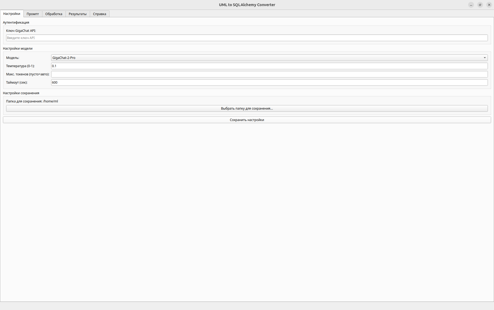
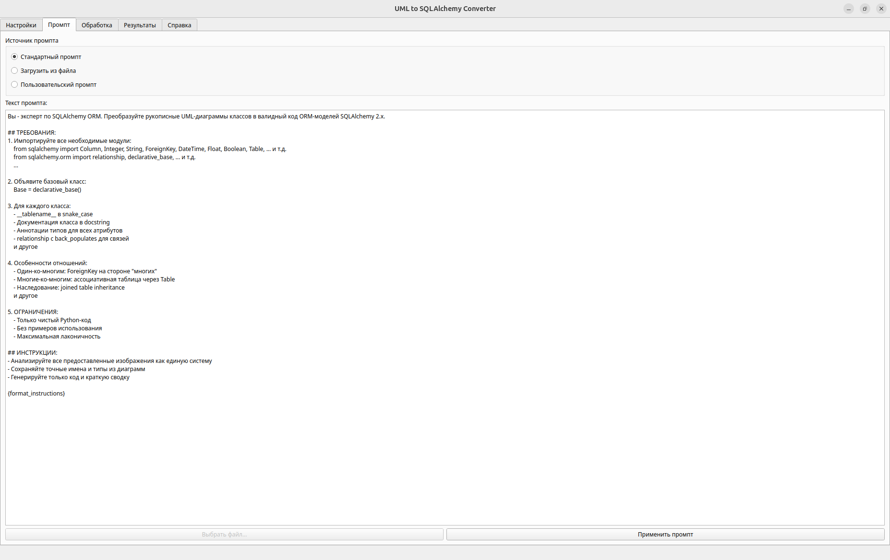
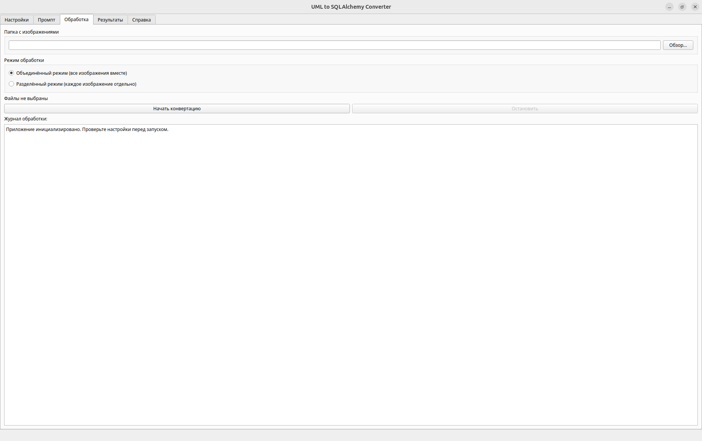
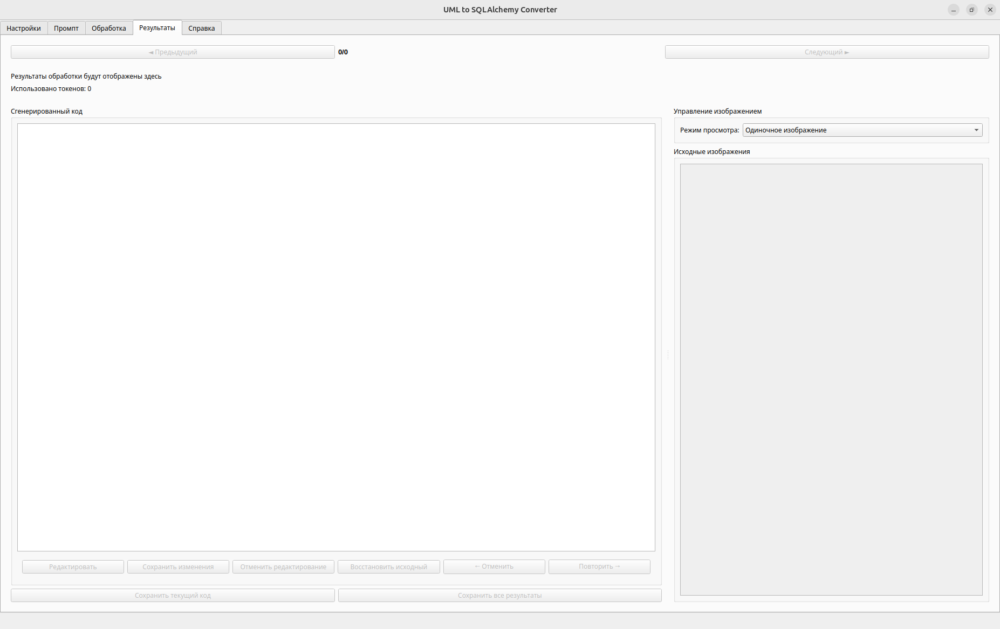
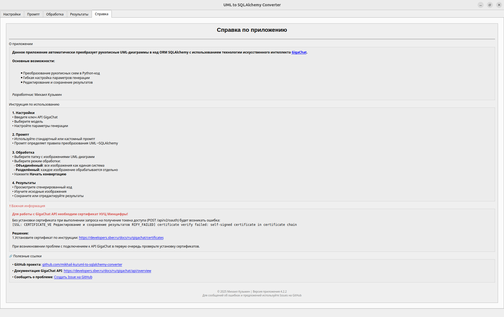

# UML to SQLAlchemy ORM Converter

*Автоматическое преобразование UML-диаграмм в SQLAlchemy ORM-модели*

Приложение для конвертации рукописных UML-диаграмм в код ORM SQLAlchemy с использованием искусственного интеллекта GigaChat. Позволяет разработчикам автоматизировать процесс создания моделей баз данных, экономя часы ручной работы.

## Особенности

✅ **Автоматическая генерация кода** SQLAlchemy 2.x из изображений UML  
✅ **Два режима обработки**: объединённый (все диаграммы вместе) и разделённый (каждая диаграмма отдельно)  
✅ **Редактор с историей изменений**: undo/redo, восстановление оригинальной версии  
✅ **Просмотрщик изображений** с масштабированием и навигацией  
✅ **Гибкая конфигурация**: выбор модели AI, настройка параметров генерации  
✅ **Экспорт результатов** в Python-файлы  

## Технологии

- **Python 3.10+**
- **PyQt5** - графический интерфейс
- **GigaChat API** - искусственный интеллект
- **SQLAlchemy 2.x** - ORM
- **LangChain** - интеграция с AI
- **Pydantic** - валидация данных

## Установка

1. Клонируйте репозиторий:
```bash
git clone https://github.com/mikhail-ku/uml-to-sqlalchemy-converter.git
cd uml-to-sqlalchemy-converter
```

2. Установите зависимости:
```bash
pip install -r requirements.txt
```

3. Получите API ключ GigaChat на [портале разработчиков Sber](https://developers.sber.ru/portal/products/gigachat-api)

4. Установите [сертификат НУЦ Минцифры](https://developers.sber.ru/docs/ru/gigachat/certificates) для работы с GigaChat API

## Начало работы

### Графический интерфейс
```bash
python main.py
```

### Консольная версия
```bash
python main.py --console
```

---

## Интерфейс приложения

### 1. Вкладка "Настройки"
  
*Конфигурация модели GigaChat и аутентификация*

- Ввод API ключа GigaChat
- Выбор модели (GigaChat-2, GigaChat-2-Pro, GigaChat-2-Max)
- Настройка параметров генерации:
  - Температура (творчество ответов)
  - Максимальное количество токенов
  - Таймаут запроса
- Выбор папки для сохранения результатов

### 2. Вкладка "Промпт"
  
*Настройка системного промпта для AI*

- Выбор источника промпта:
  - Стандартный (из файла `prompts/system_prompt.txt`)
  - Загрузка из файла
  - Ручной ввод
- Просмотр и редактирование текста промпта
- Автоматическая проверка наличия плейсхолдеров

### 3. Вкладка "Обработка"
  
*Загрузка и конвертация UML-диаграмм*

- Выбор папки с изображениями
- Автоматическое сканирование поддерживаемых форматов (JPG, PNG, BMP)
- Выбор режима обработки:
  - Объединённый (все изображения как единая система)
  - Разделённый (каждое изображение отдельно)
- Журнал выполнения операций
- Прогресс-бар и управление процессом конвертации

### 4. Вкладка "Результаты"
  
*Работа с сгенерированными моделями*

- Навигация по результатам обработки
- Просмотр сгенерированного кода SQLAlchemy
- Редактор с поддержкой истории изменений (undo/redo)
- Просмотр исходных изображений в трёх режимах:
  - Одиночное изображение
  - Коллаж
  - Слайдер
- Сохранение результатов:
  - Текущей модели
  - Всех моделей
  - Восстановление оригинальной версии

### 5. Вкладка "Справка"
  
*Документация и полезные ссылки*

- Общее описание приложения
- Пошаговая инструкция по использованию
- Важная информация о сертификатах
- Полезные ссылки и контакты
- Информация о версии и разработчике

---

## Примеры использования

### 1. Генерация моделей из единой UML-диаграммы
1. Загрузите изображение диаграммы классов
2. Выберите "Разделённый режим" обработки
3. Получите готовую ORM-модель в формате SQLAlchemy 2.x

### 2. Создание комплексной системы из нескольких диаграмм
1. Поместите все UML-диаграммы в одну папку
2. Выберите "Объединённый режим" обработки
3. Приложение сгенерирует полную систему взаимосвязанных моделей

### 3. Рефакторинг существующих моделей
1. Загрузите изображение модифицированной диаграммы
2. Используйте редактор кода для сравнения с оригиналом
3. Сохраните только нужные изменения с помощью истории версий

---
### Важные замечания
1. Для работы с GigaChat API необходим [сертификат НУЦ Минцифры](https://developers.sber.ru/docs/ru/gigachat/certificates)
2. Качество распознавания зависит от четкости исходных изображений
3. Сложные отношения Many-to-Many могут требовать ручной доработки

---

## Полезные ссылки

- [Документация GigaChat API](https://developers.sber.ru/docs/ru/gigachat/api/overview)
- [Инструкция по установке сертификатов](https://developers.sber.ru/docs/ru/gigachat/certificates)
- [Примеры UML-диаграмм](https://www.kaggle.com/datasets/leticiapiucco/handwritten-uml-class-diagrams)
- [Отслеживание ошибок и предложений](https://github.com/mikhail-ku/uml-to-sqlalchemy-converter/issues)

---

**Лицензия**: [MIT License](LICENSE)
